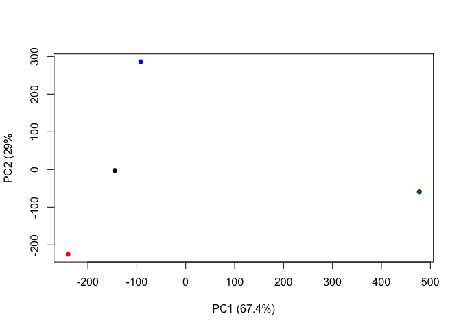

# Class 07: Machine Learning
Shubhayan Manjrekar: A17128282

Today we are going to learn how to apply different machine learning
methods, beginning with clustering.

The goal here is to find groups/clusters in your input data.

First, I will make up some data with clear groups. For this I will use
the rnorm() function:

``` r
rnorm(10)
```

     [1] -0.40467461  1.18185693 -0.31232556  0.78269240 -0.21041613  0.35311228
     [7] -0.36022443  0.33285979  0.07888653 -0.80984650

``` r
hist( rnorm(10000, mean=-3))
```


``` r
n<-30
x<- c( rnorm(n, -3), rnorm(n, +3))
y <- rev(x)
y
```

     [1]  4.5539195  3.0814042  3.2802257  3.5544396  3.2009625  3.4742128
     [7]  2.7168238  2.9154056  2.5055280  1.9839901  3.9053093  2.0044111
    [13]  3.5864725  2.3007191  5.1675018  3.9825718  3.4277985  3.7766907
    [19]  2.1845369  2.9747302  2.6584954  4.1094074  2.7890864  2.5311481
    [25]  3.6915774  3.5909439  3.7491543  2.5522394  2.5808663  2.6788954
    [31] -2.5950638 -3.2126283 -2.8409625 -3.0192413 -1.6136873 -2.2249433
    [37] -4.0383038 -3.8554751 -4.9123362 -1.9823428 -3.4424506 -1.7864263
    [43] -0.5139554 -4.0787397 -2.3681827 -3.3063581 -3.2069257 -2.3926680
    [49] -3.3665779 -2.1684847 -1.7675748 -3.7155469 -2.1218488 -1.4448386
    [55] -2.9552124 -4.8161932 -3.9199960 -4.3234923 -3.3853937 -1.5436034

``` r
z<- cbind(x, y)
head(z)
```

                 x        y
    [1,] -1.543603 4.553920
    [2,] -3.385394 3.081404
    [3,] -4.323492 3.280226
    [4,] -3.919996 3.554440
    [5,] -4.816193 3.200962
    [6,] -2.955212 3.474213

``` r
plot(z)
```


Use the kmeans() function setting k to 2 and nstart=20 Inspect/print the
results \< Q. How many points are in each cluster? \< Q. What
‘component’ of your result object details - cluster size? - cluster
assignment/membership? - cluster center? Plot x colored by the kmeans
cluster assignment and add cluster centers as blue points

``` r
km<- kmeans(z, centers=2)
km
```

    K-means clustering with 2 clusters of sizes 30, 30

    Cluster means:
              x         y
    1 -2.897315  3.183649
    2  3.183649 -2.897315

    Clustering vector:
     [1] 1 1 1 1 1 1 1 1 1 1 1 1 1 1 1 1 1 1 1 1 1 1 1 1 1 1 1 1 1 1 2 2 2 2 2 2 2 2
    [39] 2 2 2 2 2 2 2 2 2 2 2 2 2 2 2 2 2 2 2 2 2 2

    Within cluster sum of squares by cluster:
    [1] 49.7392 49.7392
     (between_SS / total_SS =  91.8 %)

    Available components:

    [1] "cluster"      "centers"      "totss"        "withinss"     "tot.withinss"
    [6] "betweenss"    "size"         "iter"         "ifault"      

Results in kmeans object `km`

``` r
attributes(km)
```

    $names
    [1] "cluster"      "centers"      "totss"        "withinss"     "tot.withinss"
    [6] "betweenss"    "size"         "iter"         "ifault"      

    $class
    [1] "kmeans"

> Q cluster size?

``` r
km$size
```

    [1] 30 30

> Qcluster assignment/membership?

``` r
km$cluster
```

     [1] 1 1 1 1 1 1 1 1 1 1 1 1 1 1 1 1 1 1 1 1 1 1 1 1 1 1 1 1 1 1 2 2 2 2 2 2 2 2
    [39] 2 2 2 2 2 2 2 2 2 2 2 2 2 2 2 2 2 2 2 2 2 2

> Q cluster center?

``` r
km$centers
```

              x         y
    1 -2.897315  3.183649
    2  3.183649 -2.897315

> QPlot z colored by the kmeans cluster assignment and add cluster
> centers as blue points

``` r
plot(z, col="red")
```


R will recycle the shorter color vector to be the same length as the
longer number of data points in z

``` r
plot(z, col=c(col="red","blue" ))
```


``` r
plot(z, col=c(1,3) )
```


``` r
plot(z, col=km$cluster)
```


We can use the `points()` function to add new points to an existing
plot…like the cluster centers

``` r
plot(z, col=km$cluster)
points(km$centers, col="blue", pch=16, cex=3)
```


> Q: Can you run kmeans and ask for 4 clusters please and plot the
> results like we have done above?

``` r
km4<- kmeans(z, centers=4)
plot(z, col=km4$cluster)
points(km4$centers, col="blue", pch=16, cex=3)
```


## Hierarchial Clustering

Let’s Take our same made-up data `z` and see how hclust works.

First we need a distance matrix of our data to be clustere

``` r
d<- dist(z)
hc<- hclust(d)
hc
```


    Call:
    hclust(d = d)

    Cluster method   : complete 
    Distance         : euclidean 
    Number of objects: 60 

``` r
plot(hc)
abline(h=8,col="red")
```


``` r
cutree(hc, h=8)
```

     [1] 1 1 1 1 1 1 1 1 1 1 1 1 1 1 1 1 1 1 1 1 1 1 1 1 1 1 1 1 1 1 2 2 2 2 2 2 2 2
    [39] 2 2 2 2 2 2 2 2 2 2 2 2 2 2 2 2 2 2 2 2 2 2

I can get my cluster membership vector by “cutting the tree” with the
`cutree()` function like so:

``` r
grps<- cutree(hc, h=8)
grps
```

     [1] 1 1 1 1 1 1 1 1 1 1 1 1 1 1 1 1 1 1 1 1 1 1 1 1 1 1 1 1 1 1 2 2 2 2 2 2 2 2
    [39] 2 2 2 2 2 2 2 2 2 2 2 2 2 2 2 2 2 2 2 2 2 2

Can you plot `z` colored by our hclust results:

``` r
plot(z, col=grps)
```


## PCA of UK food data

Read data from the UK on food consumption in different parts of the UK.

``` r
url<- "https://tinyurl.com/UK-foods"
x<- read.csv(url, row.names=1)
head(x)
```

                   England Wales Scotland N.Ireland
    Cheese             105   103      103        66
    Carcass_meat       245   227      242       267
    Other_meat         685   803      750       586
    Fish               147   160      122        93
    Fats_and_oils      193   235      184       209
    Sugars             156   175      147       139

``` r
barplot(as.matrix(x), beside=T, col=rainbow(nrow(x)))
```


``` r
barplot(as.matrix(x), beside=F, col=rainbow(nrow(x)))
```


A so-called “Pairs” plot can be useful for small datasets like this.

``` r
pairs(x, col=rainbow(10), pch=16)
```


It is hard to see structure and trends in even this small dataset. How
will we ever do this when we have big datasets with 1,000s or tens of
thousands of things we are measuring…

### PCA to the rescue

Let’s see how PCA deals with this dataset. So main function in base R to
do PCA is called `prcomp()`

``` r
pca<- prcomp(t(x) )
summary(pca)
```

    Importance of components:
                                PC1      PC2      PC3       PC4
    Standard deviation     324.1502 212.7478 73.87622 3.176e-14
    Proportion of Variance   0.6744   0.2905  0.03503 0.000e+00
    Cumulative Proportion    0.6744   0.9650  1.00000 1.000e+00

Let’s see what is insid this `pca` object that we created from running
`prompt()`

``` r
attributes(pca)
```

    $names
    [1] "sdev"     "rotation" "center"   "scale"    "x"       

    $class
    [1] "prcomp"

``` r
pca$x
```

                     PC1         PC2        PC3           PC4
    England   -144.99315   -2.532999 105.768945 -4.894696e-14
    Wales     -240.52915 -224.646925 -56.475555  5.700024e-13
    Scotland   -91.86934  286.081786 -44.415495 -7.460785e-13
    N.Ireland  477.39164  -58.901862  -4.877895  2.321303e-13

``` r
plot(pca$x [,1], pca$x[,2], col=c("black", "red", "blue", "darkgreen"), pch=16 )
```


``` r
plot(pca$x [,1], pca$x[,2], col=c("black", "red", "blue", "darkgreen"), pch=16, xlab="PC1 (67.4%)", ylab="PC2 (29%" )
```


